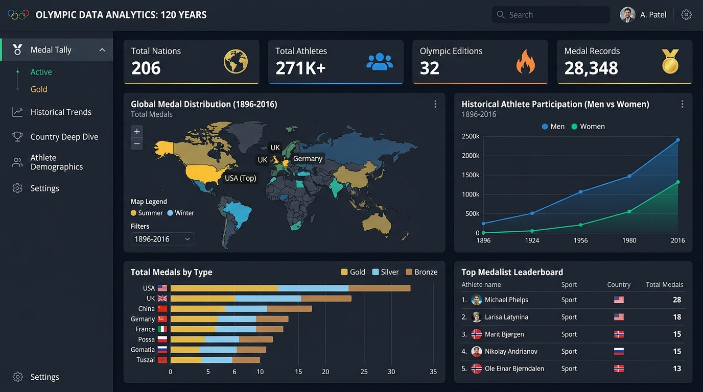

# 🏅 Olympic Data Analytics: 120 Years (1896 – 2016)



An interactive, multi-dimensional data analytics web application exploring 120 years of Olympic history across 271,000+ athlete records, 206 nations, and 32 Olympic editions.

---

## 🌟 Key Modules & Features

* **Global Medal Tally & Map:** Interactive year-wise and nation-wise filters, world choropleth medal intensity map, and stacked Gold/Silver/Bronze breakdown charts.
* **120-Year Historical Trends:** Multi-metric time-series visualizations tracking athlete participation growth (Men vs Women), event expansions, and sport-wise timeline heatmaps.
* **Country Deep Dive:** Select any nation to view its historical medal trajectory, sport dominance matrix, and all-time top 10 medalists.
* **Athlete Demographics:** Physical profiles and distribution curves analyzing medalist ages, height vs. weight clustering by sport, and gender parity evolution.

---

## 🛠️ Tech Stack

* **Language:** Python
* **Web Framework:** Streamlit
* **Data Processing:** Pandas, NumPy
* **Data Visualization:** Plotly (Choropleth Maps, Heatmaps, Distplots, Stacked Charts), Scipy
* **Development Environment:** Jupyter Notebook

---

## 🚀 Quick Start (Local Setup)

### 1. Clone the repository
```bash
git clone https://github.com/tamimystic/Olympics-Data-Analysis-ML-Project.git
cd Olympics-Data-Analysis-ML-Project
```

### 2. Create and activate a virtual environment
```bash
conda create -n olympics python=3.10 -y
conda activate olympics
```

### 3. Install dependencies
```bash
pip install -r requirements.txt
```

### 4. Run the Streamlit Application
```bash
streamlit run app.py
```

---

## ☁️ Deployment

### Streamlit Community Cloud (Recommended)
1. Push this repository to your GitHub.
2. Go to [share.streamlit.io](https://share.streamlit.io) and click **"New app"**.
3. Select this repository, branch `main`, and main file path `app.py`.
4. Click **"Deploy"**!

---

## 👤 Author
- **MD. Tamim Hossain** — Computer Science & Engineering